# MindMem Current Architecture

This document describes only components that are currently implemented.

Detailed visual version: [current-architecture.html](current-architecture.html)

## Data Flow

```mermaid
flowchart LR
    subgraph Input[Input Layer]
        A[RawTextInput] --> B[Input validation]
        B --> C[TextInputEvent]
    end

    subgraph Sensory[Text Sensory Layer]
        D[Lightweight relevance heuristics]
        R{Heuristic result}
        E[LLM relevance scorer]
        F[Structured memory extraction]
        G[JSON LLM providers]
        N[Not stored]

        D --> R
        R -- noise --> N
        R -- unclear: LLM required --> E
        R -- relevant --> F
        E -- score below 0.40 --> N
        E -- score at least 0.40 --> F
        G -. structured JSON .-> E
        G -. structured JSON .-> F
    end

    subgraph ShortTerm[Short-Term Memory]
        H[ShortTermMemoryRecord]
        I[Session buffer]
        J[Topic grouping]
        K[Active topics]
        L[Reasoning and task state]
        M[Context retrieval]
        O[Agent-ready context]

        H --> I --> J
        J --> K
        J --> L
        I --> M
        K --> M
        L --> M
        M --> O
    end

    C --> D
    F --> H
```



## Components

| Component | Responsibility | File |
| --- | --- | --- |
| Text input | Validate raw text and create immutable input events | `mindmem/input/text.py` |
| Lightweight relevance | Classify obvious noise and relevant messages using weighted spaCy signals | `mindmem/sensory/lightweight_relevance.py` |
| LLM relevance | Score only unclear messages; Python derives the label using `0.40` | `mindmem/sensory/relevance/llm_relevance.py` |
| LLM providers | Send schema-constrained JSON requests to OpenAI, Anthropic, or Gemini | `mindmem/sensory/relevance/llm_providers.py` |
| Memory extraction | Extract entities, facts, memory types, evidence, confidence, and raw temporal expressions | `mindmem/sensory/extraction/llm_extraction.py` |
| Short-term memory | Store and retrieve recent relevant records by user and session | `mindmem/memory/short_term.py` |
| Topic grouping | Group related records using weighted entity and fact signals; track the latest active topics | `mindmem/memory/topics.py` |
| Reasoning state | Store explicit decisions, tasks, task status, and tool results under a topic | `mindmem/memory/reasoning_state.py` |
| Context retrieval | Assemble a selected topic's records, decisions, unfinished tasks, and tool results for an agent | `mindmem/memory/retrieval.py` |

## Relevance Flow

```text
Lightweight result: noise
-> stop

Lightweight result: relevant
-> structured extraction
-> short-term memory

Lightweight result: unclear
-> LLM returns score and optional reason
-> Python derives label
-> score >= 0.40: extract and store
-> score < 0.40: stop
```

The LLM does not return the relevance label. Python derives it from the score.

## Extraction Output

The structured extraction contains:

- `source_text`
- `memory_types`
- `entities`
- `facts`
- evidence spans
- confidence scores
- raw temporal expressions

The output is checked with Pydantic, JSON Schema, and Python validation.

## Short-Term Record

Each `ShortTermMemoryRecord` contains:

- `id`
- `event_id`
- `user_id`
- `session_id`
- `topic_id`
- `relevance_score`
- `extraction`
- `stored_at`

Records are held in RAM under a `(user_id, session_id)` key. Each session keeps
the latest 50 records by default. When capacity is exceeded, the oldest record is
removed. Records disappear when the application process stops.

## Topics And State

Topic grouping reuses entities and facts from extraction, so it makes no additional
LLM call. Related records share a `TopicGroup`. The three most recently used topics
are active by default, and using an older topic reactivates it.

Each topic can hold explicit working state:

- decisions with `recorded` status
- tasks with `open`, `in_progress`, `completed`, or `blocked` status
- tool results with `recorded` status

Task extractions are added automatically as open tasks. Decisions and tool results
are added explicitly by the agent. Private chain-of-thought is not stored.

`ShortTermContextRetriever` selects the current topic by default or an explicit topic
from the same session. It returns topic records, decisions, unfinished tasks, and tool
results without making an LLM call or changing memory. `record_limit` can restrict
the returned records to the latest items.

## Troubleshooting

| Problem | Check |
| --- | --- |
| Invalid IDs, empty text, or incorrect event data | `mindmem/input/text.py` |
| Incorrect heuristic relevance | `mindmem/sensory/lightweight_relevance.py` |
| Incorrect LLM relevance score or schema error | `mindmem/sensory/relevance/llm_relevance.py` |
| Provider request or structured-output failure | `mindmem/sensory/relevance/llm_providers.py` |
| Incorrect entities, facts, evidence, or temporal expressions | `mindmem/sensory/extraction/llm_extraction.py` |
| Missing, reordered, or mixed session records | `mindmem/memory/short_term.py` |
| Incorrect topic grouping or active-topic order | `mindmem/memory/topics.py` |
| Missing decisions, tasks, statuses, or tool results | `mindmem/memory/reasoning_state.py` |
| Missing or cross-session agent context | `mindmem/memory/retrieval.py` |

## Runnable Examples

- `.venv/bin/python -m examples.llm_scoring`
- `.venv/bin/python -m examples.llm_extraction`
- `.venv/bin/python -m examples.short_term_memory`
